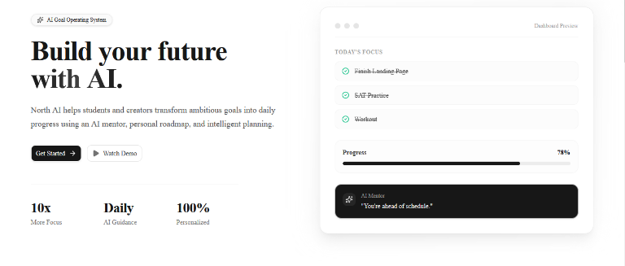
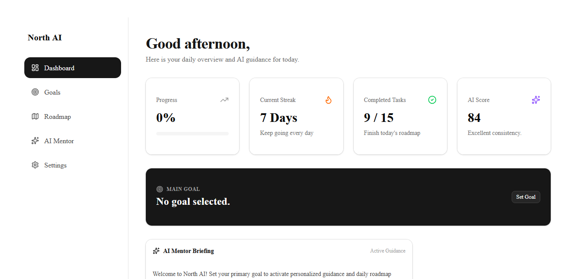

# 🚀 North AI

> Your AI-powered mentor for achieving ambitious goals.

North AI is a modern productivity platform that helps users define goals, generate structured roadmaps, track progress, and stay consistent using AI-driven guidance.

---

## ✨ Features

- 🎯 Goal onboarding
- 🗺️ Personalized roadmap generation
- ✅ Interactive task tracking
- 📈 Progress calculation
- 🔥 Streak system
- 📊 Productivity dashboard
- 👤 Authentication
- ☁️ Supabase integration
- 📱 Responsive UI

---

## 🖥️ Screenshots

> *(Replace these with your own screenshots later)*

### Landing Page



### Dashboard



### Roadmap


---

## 🛠 Tech Stack

- Next.js 15
- React
- TypeScript
- Tailwind CSS
- shadcn/ui
- Supabase
- Lucide Icons
- Vercel

---

## 📂 Project Structure

```
app/
components/
lib/
types/
public/
```

---

## ⚡ Installation

```bash
git clone https://github.com/abrorovhumoyunmirzo/north-ai.git

cd north-ai

npm install

npm run dev
```

---

## 🌐 Live Demo

**Vercel**

https://north-ai-mu.vercel.app/

---

## 🎯 Roadmap

- ✅ Landing Page
- ✅ Dashboard
- ✅ Goal Engine
- ✅ Roadmap Generator
- ✅ Progress Tracker
- ✅ Authentication UI
- ✅ Sidebar Navigation
- 🔄 Supabase Database
- 🔄 AI Mentor
- 🔄 Notifications
- 🔄 Mobile Optimization

---

## 📈 Future Features

- GPT-powered AI Mentor
- Daily planning
- Smart reminders
- Calendar integration
- Team collaboration
- Habit tracking
- Analytics

---

## 👨‍💻 Author

**Humoyunmirzp Abrorov**

AI & Full-Stack Developer

GitHub:
https://github.com/abrorovhumoyunmirzo

LinkedIn:
(Coming Soon)

---

## ⭐ Support

If you like this project, consider giving it a ⭐ on GitHub.
